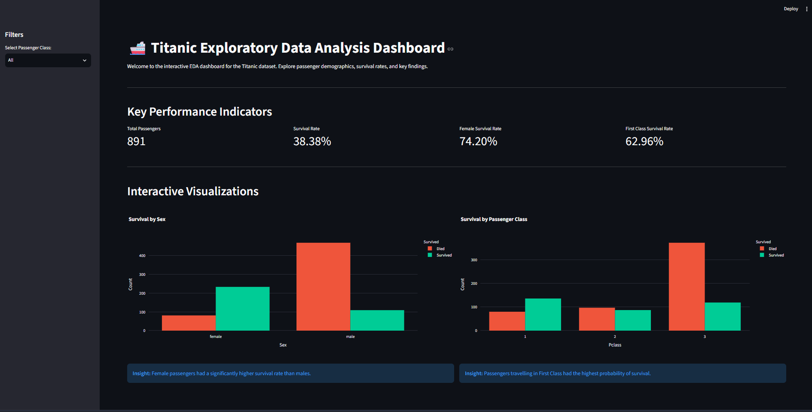

# 🚢 Titanic Survival Analysis & Prediction

An end-to-end Data Science project covering Exploratory Data Analysis, Interactive Dashboards, Machine Learning Modeling, and REST API Deployment — built around the classic Titanic dataset.

---

## 📁 Repository Structure

```text
Week2-FWC/
├── Titanic-Dataset.csv          # Source dataset (891 rows × 12 columns)
├── requirements.txt             # Global Python dependencies
├── README.md                    # This file
│
├── mini-project-A/              # Phase 1 — EDA & Dashboard
│   ├── EDA.py                   #   EDA pipeline script
│   ├── app.py                   #   Streamlit dashboard
│   ├── requirements.txt         #   Project-specific dependencies
│   ├── README.md                #   Documentation
│   ├── Screenshot/              #   Dashboard screenshots
│   └── output/                  #   Generated charts, reports, and Plotly HTML
│
└── mini-project-B/              # Phase 2 — ML Modeling & API
    ├── training.ipynb           #   Jupyter Notebook — ML pipeline
    ├── app.py                   #   FastAPI prediction API
    ├── model.pkl                #   Serialized best model
    ├── requirements.txt         #   Project-specific dependencies
    ├── README.md                #   Documentation
    └── Screenshots/             #   API Swagger UI screenshots
```

---

## 📊 Phase 1 — [Mini Project A: EDA & Dashboard](./mini-project-A/)

A comprehensive Exploratory Data Analysis of the Titanic dataset with automated insights and an interactive Streamlit dashboard.

### What It Does
- Runs a **9-step EDA pipeline** covering dataset overview, missing values, statistics, distributions, correlations, and feature-level insights.
- Generates **28 output files** — PNG charts, interactive Plotly HTML visualizations, and a markdown summary report.
- Serves an interactive **Streamlit Dashboard** with KPI cards, sidebar filters, and Plotly charts.

### Key Discoveries

| Insight | Value |
|---|---|
| Overall Survival Rate | 38.38% |
| Female Survival Rate | 74.2% vs Male 18.9% |
| 1st Class Survival Rate | 63.0% |
| 3rd Class Survival Rate | 24.2% |
| Child Survival Rate | 58.0% |
| Best Family Size | 4 members (72.4%) |
| Port Cherbourg Survival | 55.4% (highest) |

### Dashboard Preview



**Technologies:** Python · Pandas · NumPy · Matplotlib · Seaborn · Plotly · Streamlit

---

## 🤖 Phase 2 — [Mini Project B: ML Modeling & API](./mini-project-B/)

Machine Learning model training with 9 classifiers, robust evaluation using ROC-AUC and Cross-Validation, and a FastAPI REST API for real-time predictions.

### What It Does
- Builds a **Scikit-Learn preprocessing pipeline** (imputation, scaling, one-hot encoding).
- Trains and evaluates **9 classification models** with 7 metrics each.
- Uses **5-Fold Cross-Validation** and **ROC-AUC** for robust evaluation.
- Deploys a **FastAPI REST API** with Swagger UI for live predictions.

### Model Comparison Results

| Model | Accuracy | F1 Score | ROC-AUC | CV Accuracy |
|---|---|---|---|---|
| **Logistic Regression** 🏆 | **0.8547** | **0.8030** | **0.8787** | 0.8227 |
| Support Vector Machine | 0.8436 | 0.7879 | 0.8451 | **0.8339** |
| Gaussian Naive Bayes | 0.8212 | 0.7714 | 0.8582 | 0.8047 |
| K-Nearest Neighbors | 0.8212 | 0.7576 | 0.8530 | 0.8160 |
| Gradient Boosting | 0.8156 | 0.7402 | 0.8505 | 0.8294 |
| AdaBoost | 0.8101 | 0.7606 | 0.8547 | 0.8137 |
| Random Forest | 0.8101 | 0.7463 | 0.8234 | 0.7957 |
| Extra Trees | 0.8101 | 0.7463 | 0.8098 | 0.7812 |
| Decision Tree | 0.8045 | 0.7407 | 0.7785 | 0.7654 |

### API Preview


**Technologies:** Python · Scikit-Learn · Pandas · NumPy · Joblib · FastAPI · Uvicorn · Jupyter Notebook

---

## ⚙️ Global Installation

Install all dependencies for both phases using the root `requirements.txt`:

```bash
pip install -r requirements.txt
```

> **Python 3.11+** is required.

---

## 🚀 Quick Start

### Run the EDA & Dashboard (Phase 1)
```bash
cd mini-project-A
python EDA.py              # Run the EDA pipeline
streamlit run app.py       # Launch the dashboard
```

### Run the ML Pipeline & API (Phase 2)
```bash
cd mini-project-B
jupyter notebook training.ipynb          # Train models
uvicorn app:app --reload --port 8001     # Start the API
```

Then open the API docs at: `http://127.0.0.1:8001/docs`

---

## 📜 License

This project is licensed under the terms included in [LICENSE.txt](./LICENSE.txt).
