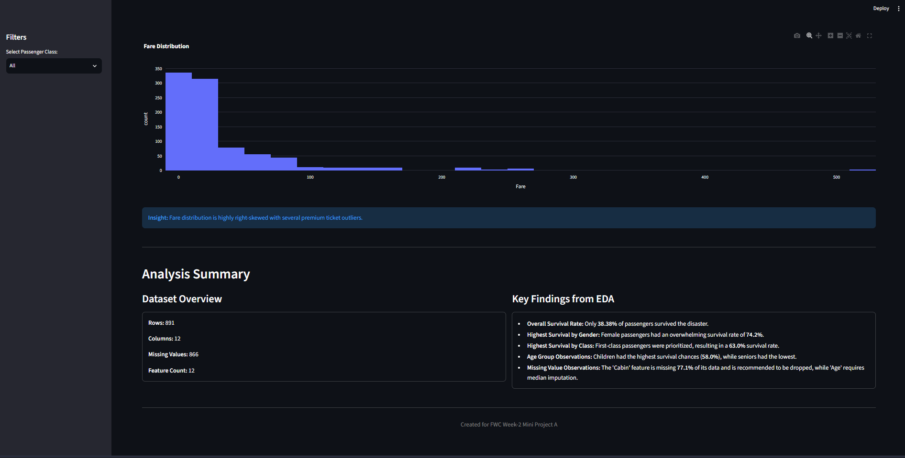

# 📊 Mini Project A — Titanic Exploratory Data Analysis & Dashboard

## Project Overview

This project presents a comprehensive Exploratory Data Analysis (EDA) of the famous Titanic dataset. The goal is to uncover patterns, demographics, and key factors that influenced passenger survival during the tragedy. The analysis is structured into a Python script generating deep insights and an interactive **Streamlit dashboard** for easy visualization.

---

## Objectives

- Conduct a thorough EDA to understand the dataset's structure and quality.
- Handle missing values and detect outliers.
- Perform feature engineering to extract better predictive features (e.g., `FamilySize`, `Title`).
- Visualize distributions and relationships between features and the target variable (`Survived`).
- Build a user-friendly **Streamlit dashboard** with KPIs and interactive Plotly charts.

---

## Dataset

| Property | Value |
|---|---|
| **Rows** | 891 |
| **Columns** | 15 (including engineered features) |
| **Target Variable** | `Survived` (0 = Died, 1 = Survived) |
| **Memory Usage** | 0.14 MB |

### Missing Values

| Feature | Missing Count | Percentage | Recommendation |
|---|---|---|---|
| `Cabin` | 687 | 77.1% | Drop the feature |
| `Age` | 177 | 19.9% | Median imputation |
| `Embarked` | 2 | 0.2% | Drop rows or impute mode |

---

## EDA Pipeline

The analysis script (`EDA.py`) executes the following 9-step pipeline:

1. **Dataset Overview** — Shape, datatypes, memory usage, first 5 rows
2. **Target Analysis** — Overall survival rate and death rate
3. **Missing Value Analysis** — Missing percentages, dynamic recommendations, heatmap
4. **Statistical Summary** — Mean, std, variance, skewness, kurtosis for numeric features
5. **Distribution Analysis** — Histograms, KDE plots, and Boxplots for `Age` and `Fare`
6. **Univariate Analysis** — Count plots for `Survived`, `Pclass`, `Sex`, `Embarked`, `FamilySize` (PNG + interactive Plotly HTML)
7. **Bivariate Analysis** — Survival rates by `Sex`, `Pclass`, `Embarked`, `Age`, `Fare` (PNG + interactive Plotly HTML)
8. **Correlation & Relationship Analysis** — Correlation matrix heatmap, pairplot, interactive Plotly scatter matrix
9. **Feature-Level & Data-Driven Insights** — Dynamic insights per feature with automatic summary report generation

---

## 🔍 Key Findings

Based on the data-driven analysis generated by the script:

| Insight | Value |
|---|---|
| **Overall Survival Rate** | 38.38% |
| **Female Survival Rate** | 74.2% |
| **Male Survival Rate** | 18.9% |
| **1st Class Survival Rate** | 63.0% |
| **2nd Class Survival Rate** | 47.3% |
| **3rd Class Survival Rate** | 24.2% |
| **Child Survival Rate** | 58.0% |
| **Senior Survival Rate** | 22.7% |
| **Port C (Cherbourg) Survival** | 55.4% |
| **Port Q (Queenstown) Survival** | 39.0% |
| **Port S (Southampton) Survival** | 33.7% |
| **Best Family Size for Survival** | 4 members (72.4%) |

### Statistical Highlights

| Feature | Mean | Skewness | Kurtosis |
|---|---|---|---|
| `Age` | 29.70 | 0.39 | 0.18 |
| `Fare` | 32.20 | 4.79 | 33.40 |
| `SibSp` | 0.52 | 3.70 | 17.88 |
| `FamilySize` | 1.90 | 2.73 | 9.16 |

> **Fare** distribution is highly right-skewed (skewness = 4.79) with extreme outliers corresponding to premium first-class tickets (max fare: $512.33).

---

## Dashboard Features

The **Streamlit** app (`app.py`) provides an interactive way to explore the data:

- **🎯 KPI Cards** — Total Passengers, Survival Rate, Female Survival Rate, First Class Survival Rate
- **🎛️ Sidebar Filter** — Filter the entire dashboard by Passenger Class (All / 1st / 2nd / 3rd)
- **📈 Interactive Plotly Charts** — Survival by Sex, Survival by Passenger Class, Fare Distribution
- **📊 Dynamic Metrics** — All KPIs adjust instantly based on the selected filter
- **📋 Analysis Summary** — Dataset overview and key EDA findings

---

## 📸 Dashboard Preview

### KPIs & Interactive Visualizations


### Fare Distribution & Analysis Summary


---

## Technologies Used

| Technology | Purpose |
|---|---|
| Python | Core language |
| Pandas & NumPy | Data manipulation |
| Matplotlib & Seaborn | Static visualizations |
| Plotly | Interactive visualizations |
| Scipy | Statistical computations |
| Streamlit | Interactive dashboard |

---

## Project Structure

```text
mini-project-A/
├── EDA.py                  # Python EDA pipeline script
├── app.py                  # Streamlit dashboard application
├── requirements.txt        # Python dependencies
├── README.md               # Project documentation
├── Cli-output of eda.txt   # Full CLI output log of EDA.py
├── Screenshot/
│   ├── All-1st.png         # Dashboard top section
│   └── All-2nd.png         # Dashboard bottom section
└── output/
    ├── summary.md                         # Auto-generated EDA summary
    ├── correlation_heatmap.png            # Correlation heatmap
    ├── missing_value_heatmap.png          # Missing value heatmap
    ├── pairplot.png                       # Seaborn pairplot
    ├── distribution_age.png               # Age distribution (Hist + KDE + Box)
    ├── distribution_fare.png              # Fare distribution (Hist + KDE + Box)
    ├── univariate_*.png                   # Univariate count plots
    ├── bivariate_*.png                    # Bivariate analysis plots
    ├── plotly_univariate_*.html           # Interactive Plotly univariate charts
    ├── plotly_bivariate_*.html            # Interactive Plotly bivariate charts
    ├── plotly_scatter_age_fare.html       # Interactive Age vs Fare scatter
    └── plotly_scatter_matrix.html         # Interactive scatter matrix
```

---

## Installation & Usage

1. **Install Dependencies:**
   ```bash
   cd mini-project-A
   pip install -r requirements.txt
   ```

2. **Run the EDA Script:**
   ```bash
   python EDA.py
   ```
   All outputs (charts, reports) are saved to the `output/` directory.

3. **Launch the Dashboard:**
   ```bash
   streamlit run app.py
   ```

---

## Future Improvements

- **Additional Filters** — Add filtering by Age Group and Port of Embarkation in the dashboard.
- **Machine Learning Integration** — ✅ Completed in [Mini Project B](../mini-project-B/).
- **Real-time Dashboards** — Support dynamically uploading custom datasets to re-run the EDA pipeline.
